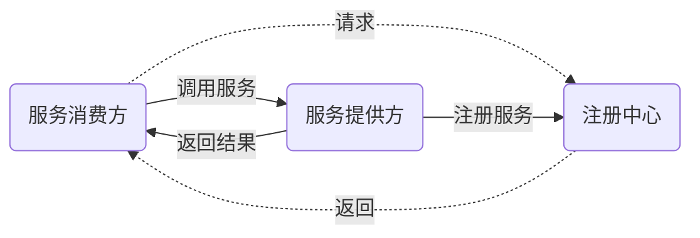
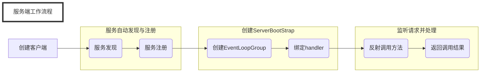
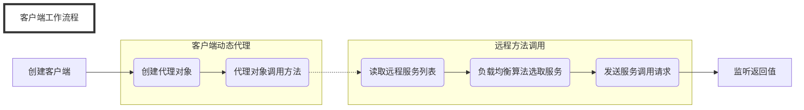

## Readme

MyRPC框架是一款仿Dubbo的RPC框架，使用Nacos作为注册中心，基于Netty进行网络传输，提供多种负载均衡算法和序列化方法。

### 主要架构

```mermaid
graph LR
A(服务消费方)
B(服务提供方)
C(注册中心)
A-.请求.->C
C-.返回.->A
B--注册服务-->C
A--调用服务-->B
B--返回结果-->A

```
###  工作流程

```mermaid
graph LR
style 服务端工作流程 fill:#ffff,stroke:#333,stroke-width:4px
a1[创建客户端]
subgraph a2[服务自动发现与注册]
b2(服务发现)-->c2(服务注册)
end
a1-->b2
subgraph a3[创建ServerBootStrap]
b3(创建EventLoopGroup)
c3(绑定handler)
b3-->c3
end
c2-->b3
subgraph a4[监听请求并处理]
b4(反射调用方法)
c4(返回调用结果)
b4-->c4
end
c3-->b4
```

```mermaid
graph LR
style 客户端工作流程 fill:#ffff,stroke:#333,stroke-width:4px
A1[创建客户端]
subgraph A2[客户端动态代理]
B2(创建代理对象)
C2(代理对象调用方法)
B2-->C2
end
A1-->B2
subgraph A3[远程方法调用]
B3(读取远程服务列表)
C3(负载均衡算法选取服务)
D3(发送服务调用请求)
B3-->C3-->D3
end
C2-.->B3
A4[监听返回值]
D3-->A4
```

